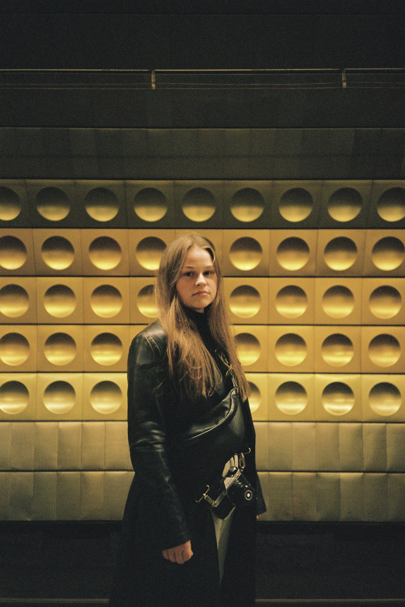
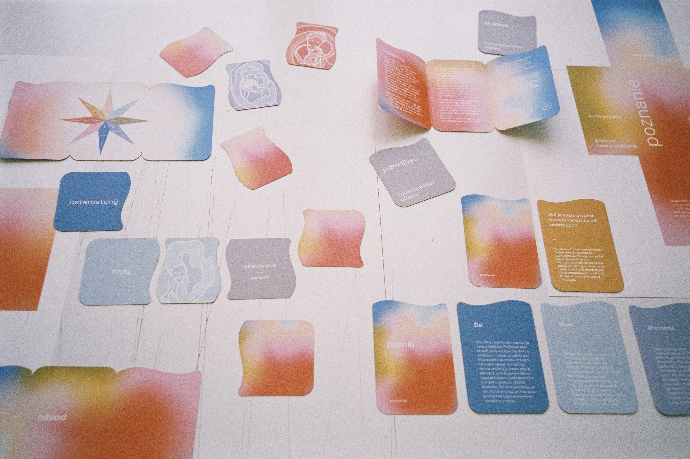

# First Impression

## Draft presentation

- [View Presentation](img/buzkova-first-impression-draft.pdf) (PDF)
- [Introduction](#introduction)
- [Projects](#projects)

## Introduction

If I were to come up with one sentence that would describe me as both a designer and an individual, it would be this: *I am an artist who merges design with inner world of individuals.*

There was a moment when creative work evolved into a powerful tool for navigating my own emotions. Following the loss of my brother, art served as a lifeline that kept our connection alive.
It has been eight years since I immersed myself in the studies of mental health and the human soul. 

I strive to create designs that resonate with others on a profound level, allowing each person to find their own depths and experience their unique emotions. 
In the future, I would like to use my work as a medium to comfort individuals, reminding them that they are not alone in their struggles.  

## Projects

I have decided to showcase these three projects, as they perfectly capture what I’ve been trying to convey about my work as an artist. It’s not just about graphic design for me; my true passions are photography and painting as well. 

### Design project / game Poznanie (Cognition)

This collaborative work, made with two fellow classmates as our final atelier project, serves as a tool to deepen connection with yourself and people around you.

It can be used as a game among friends, utilized as a learning instrument for individuals, or integrated into psychological work. We have built our concept on pure emotions that each individual experiences daily, with the aim of teaching people to not only acknowledge these emotions but also discuss them within a safe space. 

We have created two levels for this game: one for children aged 8 and above, and the second one for individuals aged 15 and older.

The principle behind the first level revolves around connecting puzzle-like cards in a sequence, including one puzzle piece of emotion (written), then an illustration showing that specific emotion, and multiple cards representing the needs we experience when feeling that emotion. Primarily targeted towards younger kids, these cards are made mainly for them to name various emotions and identify their needs.

Concept behind the second variation of the game is to talk about emotions that are often trivialized, encouraging participants to explore and learn about them. Similar to the first level, this version also comes up with cards. However, it introduces eight categories of questions, each based on one of the eight primary emotions. Additionally, the pack includes informational card about each emotion, enabling the game to serve as a self-guided learning tool.

### Design project / painting Anxiety

Painting serves as a liberating art form where I find true freedom. In my artistic process, I work until I reach the point of the impossible flawlessness. However, during the act of painting itself, I disconnect from my rational thoughts, often forgetting to use brushes and relying only on my hands. 

With this particular piece of art, I felt like I needed to visually depict the feelings I experience during my anxiety episodes. The central object, done using a sewing technique, symbolizes my own head. The disconnected eye and mouth represent the loss of my ability to communicate or see clearly when anxiety takes over me. I also worked with glass elements to convey not only the coldness getting from the above depicted through the blue colour, but also the feeling of something cutting through my skin. While everything feels as if it stopped around me, an internal fire rages within, represented by the combination of red and orange hues in the right corner. 

### Design project / book sournsweetz

This ongoing project is the most personal for me, showing my passions for graphic design, photography, and writing. In 2019 I created a secret Instagram account where I shared my favourite moments accompanied by my thoughts and emotions. However, after two years, I decided to exclude the poems from my content, as I felt overly exposed within the toxic environment Instagram often is.

This year, as part of our Typography class, we were given a task to create our own book. I deliberately decided to transform my long-held dream into reality.
Currently I am collecting my work from the past years, selecting both photographs and writings, with the hope of soon presenting my first tangible book. 

This project holds personal significance for me, as I pour my own experiences onto its pages with and open heart. Moreover, I see it as a tribute to my brother, a professional photographer whom I deeply admire and will forever look up to.

