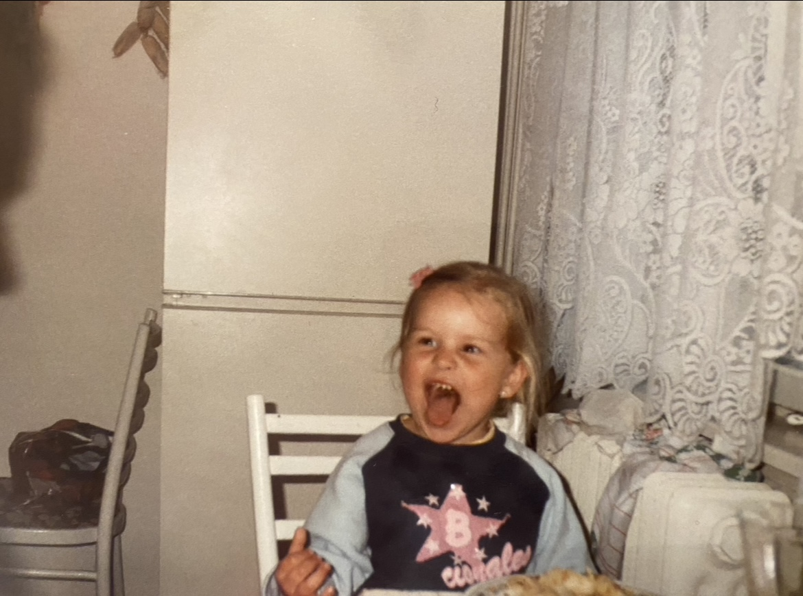
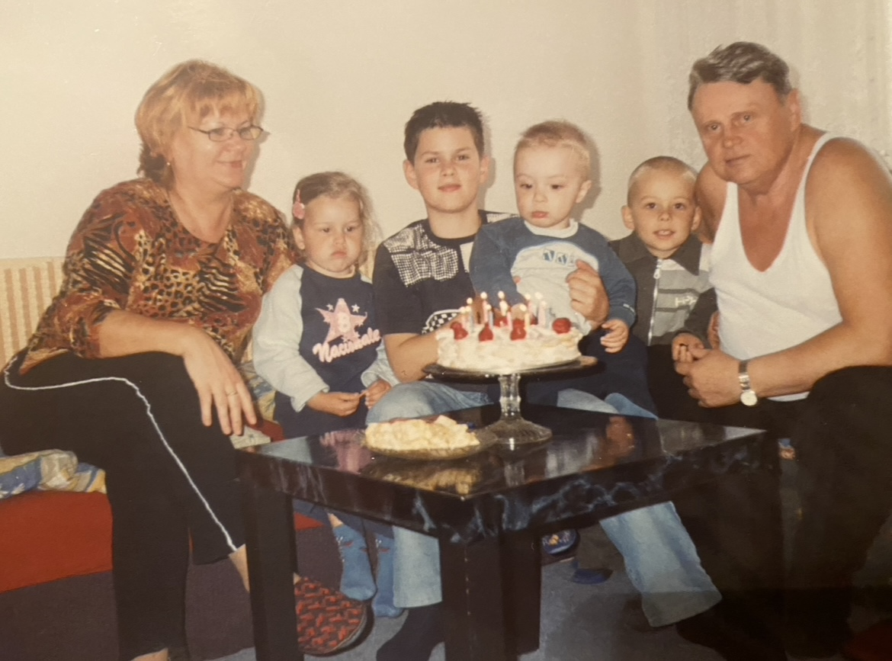
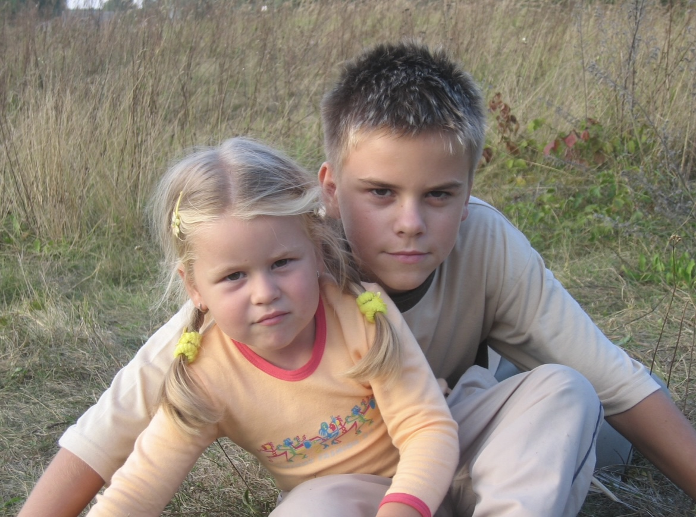
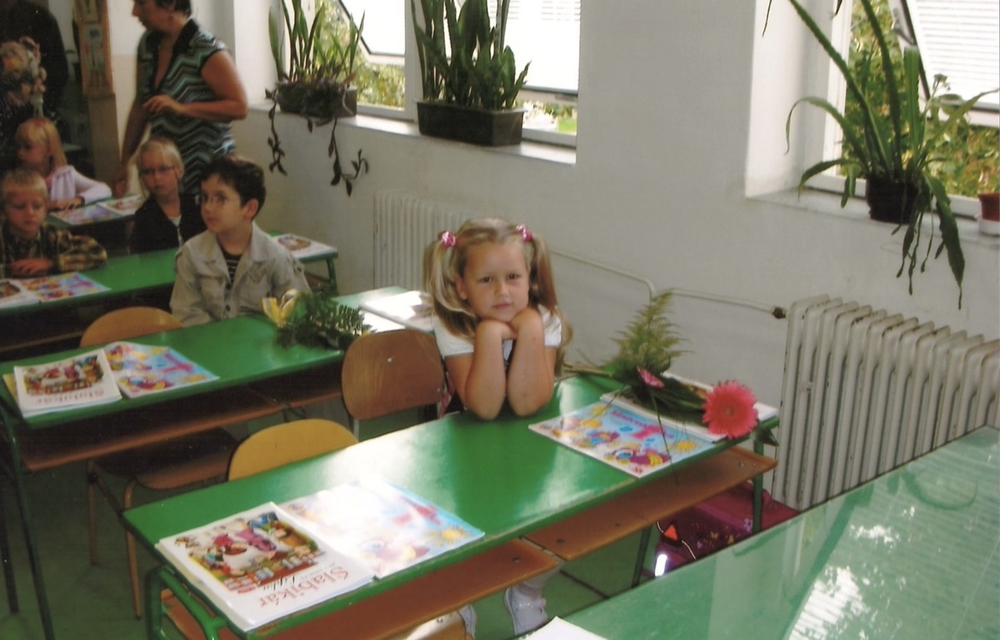
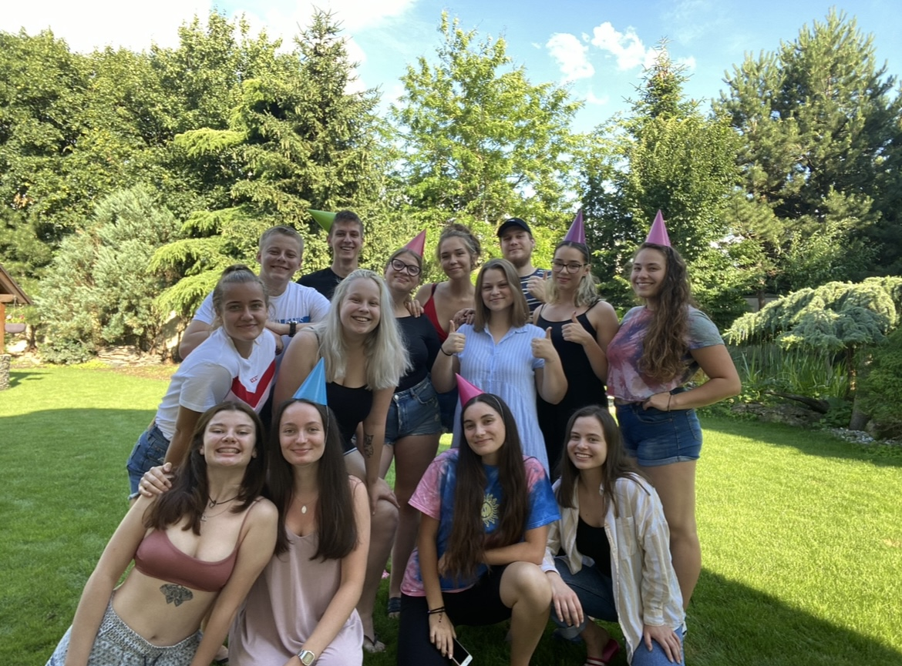
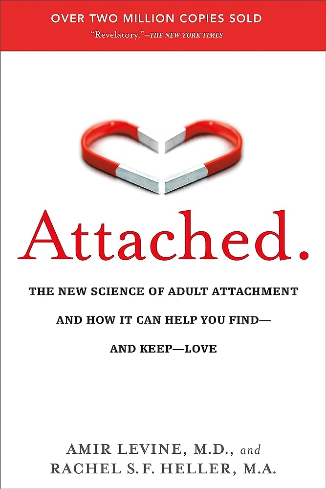
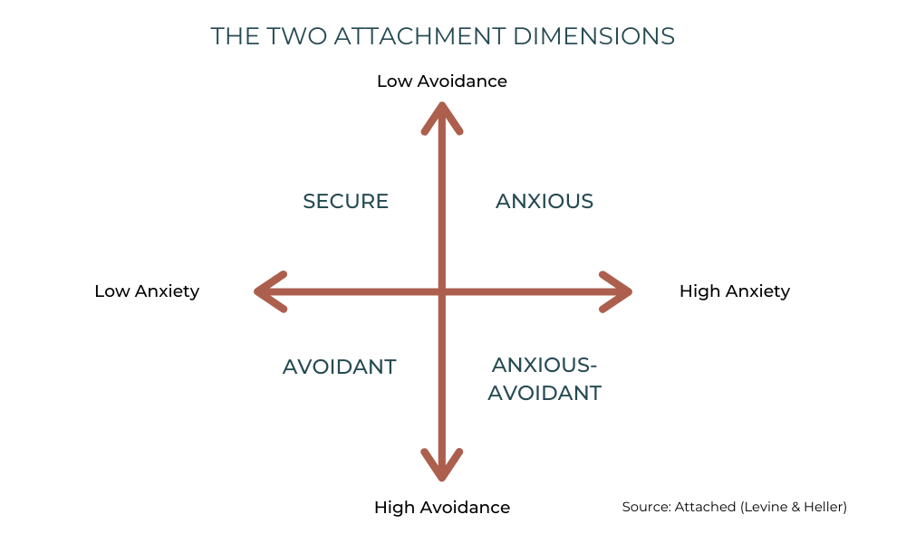
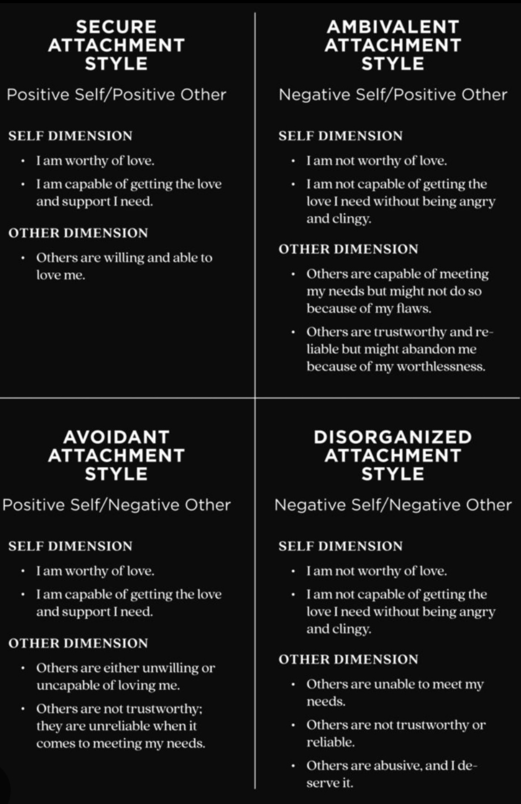

# It's the first eighteen *months* that we should focus on more.

by Natália Búzková

2 April 2024, Bratislava

- View the [process](process.md)

Hello, I'm Natália. I am going to tell you a little something about myself and why I am the way I am. Hopefully, you will learn something about yourself too. 

### Enjoy!

Growing up, I was all over the place.
Everywhere I was, you could hear me from far far away. I didn’t even try to keep it down. I did not have many friends in my age.
I loved times when I could be with people older than me, listen and analyse them.

*And I loved how they talked about me being so mature for my age.*

I spent most of my time with my family, including my brother and my other six cousins.

Being younger, I always looked up for my brother and spending time with him made me feel *special*.

I take it as I was supposed to be the calm and organized one, as only girl in the family...

Later, it got to me.

I became the most organized person you could ever imagine.

School was never a problem for me, somehow, I managed to create a schedule in my head. That way, I always had everything done in at least one week advance.
I strived to be *perfect*.

With this drive in my head, I decided to leave elementary school a year earlier and enrolled myself in bilingual gymnasium in the capital city of Slovakia, Bratislava. It is not that far from my home, but it was a huge step out of the comfort zone for me. 
I thought I was invincible, and nothing could stop me. 

Oh and also I was the *only one* from the whole family going to bilingual school.

Little did I know that life is not always going to be as I plan it. Even when it’s the best plan, with smallest possible details figured out. 

The unexpected message of my brother dying stopped my world form turning for a while.

I still don’t know how I managed to move through this time, but I was accepted to high school, and I shifted my focus towards it.
My perfectionism got worse, and I became somehow quiet, closed off. 
As the world did for me.
This time I wanted to make my parents proud ten times more than before. 

My interests shifted towards psychology. I always loved to analyse people and their behaviour, but now it became more of an obsession. 

I believed that if I get to understand minds of other people, then I will understand the one of my brother. 

My relationships changed too. Making my friends and family feel like they are never alone in this world became my top priority.
I wanted to make them feel loved, worthy and accepted. I took their problems as if they were mine and found my value in their happiness. And my personal fauilure in their grief. 

If I could tell one thing about myself, it’s that I care and I care *deeply*. 

My closest friends were afraid sometimes, because I wasn’t cautious and my need for meeting everyone’s expectations was limitless.

Looking back, I thought that the world was filled with people who look at friendships the same way I do. Turns out, it is *not*. 

Yet, only last year I realized that giving myself to someone and loving unconditionally may not always be the right way. I needed to find myself.

After having gone through some tough times, I decided to come back to reading books.
Especially those focusing on relationships. Before, I wanted to understand everything about human brain, now I wanted to know more about their emotions.

I don’t like the general talk about how one book changed someone’s life, but unfortunately this one did it for me. 

### I discovered theory of attachments.

Theory of attachment is a psychological explanation for the emotional bonds and relationships between people.
Every child is born with a need to create bonds with caregivers, and they have influence on attachments throughout our life. 

#### There are four attachment styles that could form during first 18 months of our life and will affect as till the very end of it. 

Other people can influence your attachment style too, for the better or for worse, but the one that you develop during your childhood is always going to be your starting point, from which it is *hard* to move forward. 

Firstly, psychologists divide these styles as secure and then three types of insecure attachments. Insecure styles include anxious, avoidant, and anxious-avoidant attachment. 

In case you wonder what attachment style you have fill out test B [here](https://www.web-research-design.net/cgi-bin/crq/crq.pl)

### Let’s break them down a bit. 

#### Secure attachment

Having a secure attachment means you have the ability to build healthy, fulfilling and long-lasting relationships. You feel safe, valued, understood both as a child and subsequently in your adult relationships. 

Some of the signs of secure attachment are: 
- trusting and connecting with people easily
- communicating effectively
- regulating emotions
- feeling comfortable while spending time alone
- being emotionally available

### Insecure attachment - Avoidant

Going deeper into insecure attachments, firstly let’s talk about avoidant attachment style, which makes up 25% of the population. 

The main characteristic of this attachment is having difficulty building meaningful relationships due to fear of intimacy, even during childhood, when child shows no preference between primary caregiver and a complete stranger. 
Having a strong sense of independence, they feel threatened when someone tries to get close to them. 

If you have avoidant attachment style, you might: 
- dismiss others easily
- have difficulty trusting others
- avoid both physical and emotional intimacy
- have commitment issues
- feel especially uneasy when people try to get close to you

### Insecure attachment - Anxious

Jumping to the exactly opposite side of the spectrum, let's focus on anxious attachment style, 20% of the population. 

Being the most distrustful one, anxious child become very distraught when separated from parents, but doesn’t find comfort in their return either.
Same as in adulthood, they don’t see themselves as worthy of love and attention. 

They may experience:
- deep fear of rejection
- need of external validation
- high sensitivity to criticism
- feelings of unworthiness and jealousy
- difficulty spending time alone
- fear of abandonment

### Insecure Attachment - Anxious-Avoidant or Fearful

The last of the insecure attachment, being 5% of the population, is called fearful or anxious-avoidant attachment style.

Same as it sounds, it is the most confusing style for both specialists and adults who have it.
During childhood, anxious-avoidant experiences emotional inconsistencies of their primary caregiver, often being victim of abuse, trauma, or neglect.

Signs of the attachment include the same ones as both anxious and avoidant experience: 
- they enjoy and fear spending time alone
- they crave and fear intimacy
- they have commitment issues, but fear rejection

So as much as I believed that I was *unique* in the way I felt during both my childhood and adulthood, the whole time I had anxious attachment style. Even though triggered by trauma, my need to be perfect in front of everyone else came from my early childhood experiences. 

As I said, other people can influence your attachment style to some extent even during adulthood. 
Together with deep hard work on ourselves, one day we can meet as one big *secure* family.

If the topic caught your attention, here is a list of book I recommend:

- Adult Children of Emotionally Immature Parents
- Recovering from Emotionally Immature Parents
- It Didn't Start With You
- What Happened to You?
- Set boundaries, find peace
