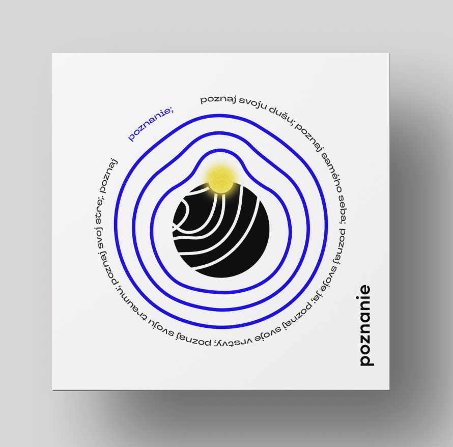

# Visual identity of Festival Poznanie (Cognition)

by Natália Búzková

3 April 2024

Watch the [slides](assets/slides.pdf) // to be added

## Abstract

The bachelor thesis focuses on creating a visual identity for the fictional self-developing festival Poznanie, whose content is based on the theme of trauma. The main goal of the festival is not to heal trauma but to open up society to this topic without tabooing it. Individuals will get closer to their personal trauma and, as part of the program, take steps closer to self-awareness, self-development, and wholeness.

The theoretical part focuses on definitions of basic concepts in graphic design such as corporate identity, marketing communication, and social networks. Subsequently, it addresses the topic of mental health and introduces terms such as mental health, trauma, and self-development. I pay attention to exploring the foreign market and draw inspiration from visual identities and campaigns of brands focused on mental health issues. I also conduct a detailed analysis of the competitive market in Slovakia.

In the practical part, I present the proposed visual identity, its use within the festival, and its promotion in both online and offline spaces. I present the main visual principle, along with the target group. Included are a questionnaire and an attachment of a survey on personal visual representation of trauma by individuals in my surroundings.

##### Key Words
visual identity, graphic design, festival, mental health, trauma

## Article

### Introduction

Hello, I am Natália and for my bachelor thesis, I chose to create a visual identity for the fictional self-developing festival called Poznanie (Cognition). 

I  see a bachelor thesis as something that defines you and your work in the field you choose to study.

I strive to create designs that resonate with others on a profound level, allowing each person to find their own depths and experience their unique emotions. In the future, I would like to use my work as a medium to comfort individuals, reminding them that they are not alone in their struggles. 

### Theoretical part

#### Main philosophy

Based on the analysis of the competitive market in Slovakia, I came to the conclusion that there is not enough space in our society that allow you to dig deeper into themes of mental health. 

After a series of discussions with professional psychologists, I gained the motivation to create a festival that focuses specifically on trauma. 
The name is based on the idea of understanding this topic, our mental health, and ourselves. Trauma is the root of a large portion of mental health problems that prevent us from living our lives to the fullest. 

The idea is to acquaint the public with their own trauma, not generally educate them about mental health. Each person experiences trauma individually, so one of the important pillars of the festival became uniqueness and individuality, not generality. 

The content of the three-day festival includes lectures, discussions, workshops, theatrical performances, and film screenings. The group of hosts consists of well-known doctors, psychiatrists, psychologists, therapists, and also people who have personal experience with trauma. 

#### Target audience

My primary target audience consists of men and women aged 18 to 50, living in Bratislava and its neighbouring cities.

They are socially responsible individuals who are engaged in the topic of mental health and recognize its importance. 
They may also have experience in this field of their lives, such as therapeutic sessions. 
This target group is interested in working on their self-development and mental health. 

Festival participants are open to progressive and alternative methods of integrating medical knowledge with spirituality, while not afraid to express their own opinions and are not conservative. 

#### Surveys

Since the festival focuses primarily on the theme of trauma, my goal was to abstractly depict it. 
I created two surveys, which I then visually processed. The main goal of both surveys was to understand the perception of this theme in my surroundings. Based on them, I created an identity, the important pillar of which is the connection with individual experiences and the processing of trauma in society.  

The first survey consisted of just one question, asking what color an individual would depict or define trauma according to their subjective perception.

The second survey focused on the representation of trauma. The participant was asked to abstractly draw the visual appearance of a traumatic experience with a single line.

#### Theoretical concept

According to the definition, trauma is the result of a significant event, and our organism perceives the threat even long after the threat has disappeared. After this experience, we remain shattered and lose our wholeness, which we can never fully restore to its pre-trauma form. 
To deal with trauma, we create so-called layers against it, which protect us from pain and suppress the fear of threat.

I have decided to abstractly elaborate on this concept and build upon it the main philosophy of the visual identity of the Cognition Festival. 

### Practical part

#### Visual concept of trauma

After processing the results obtained from the surveys, I selected one of the obtained abstracts and chose the color blue.

As I expressed before, we wrap our traumas in layers as a form of protection and an attempt to restore our broken wholeness. Around the abstract, I visually process lines that symbolize the created layers. The further they are from the object, the closer to approaching a perfect circle, but never will.  Just as with our struggle to achieve wholeness.

Visually, I represent the educational aspect of the festival, which consists of lectures and discussions, using two circles.
These circles represent the festival’s focus on individual traumas.

The first one is black, as it symbolizes lectures that are medical and psychological, clearly defined, and structured, working with facts.

Discussions delve into the spiritual and personal experiences of traumas, they offer the opposite view of trauma, which is not clearly defined and outlined – just as the complementary yellow circle depicted.

Festival brings individuals closer to the wholeness that they are trying so hard to achieve, through lectures, discussions, and workshops.

Within the line that reaches a perfect circle, I insert information related to the festival, such as the list of guest speakers, discussion and lecture titles, etc. 
It is another symbolic depiction that I work with. 

#### Logo

The logo consists of a symbol and typographically displayed name of the festival.

The symbol is composed of two circles, representing the main role and essence of the festival, which is analyzing and bringing trauma closer through interconnected approaches – medical and spiritual.
Inside the symbol, there is a segment of lines from the main abstract.

Color of the logo may vary according to its background or color of the typography used on a specific product. 

#### Color Palette

The dominant color of the festival is blue, symbolizing trauma as the main theme of the festival.
I complement it with black and white, which serve as background or text colors.

As a secondary color, I chose yellow, considering its complementary relationship with blue. It creates contrast and tension but also symbolizes hope for a future without trauma binding us. 

#### Typography

As the primary font of the visual identity, I have chosen the Sofia Pro font.
It is a sans-serif font that is part of the logo and serves as the main text font. 
It clearly expresses the idea of typeset text.

I utilize the supplementary font TT Travels as the headline font, as it creates contrast and draws attention.
With its irregular shapes, it connects with the abstract representation of trauma I used in the graphic process. 

#### Online propagation

I have decided to focus the promotion on the digital online space.
Festival communicates through social media platforms such as Instagram, Facebook, and TikTok.

Additionally, I have created a website and to expand on the themes that are part of the event, I have proposed the Poznanie podcast. 

#### Offline propagation

In offline communication, I primarily work with print advertising in the form of billboards and posters.

Additionally, I reach out to the target audience with brochures distributed in the offices of psychologists and psychotherapists. 

[Mockup of a four-fold brochure present in the offices of psychologists and psychotherapists.](../img/mockup-of-brochure-present-in-the-office-of-psychologists-and-psychotherapistis.png)

#### Products

Furthermore, I present additional visual elements that I have developed. These include various products present at the festival and merchandising.

##### Festival Ticket

##### Brochure on Festival

##### Merchandising

##### Festival accessories 

Altough Poznanie is a fictional festival, my vision for the future is to organize a similar event in Slovakia. If the opportunity arises, with the right team and financial resources, I am determined to work on this project in the future. 

