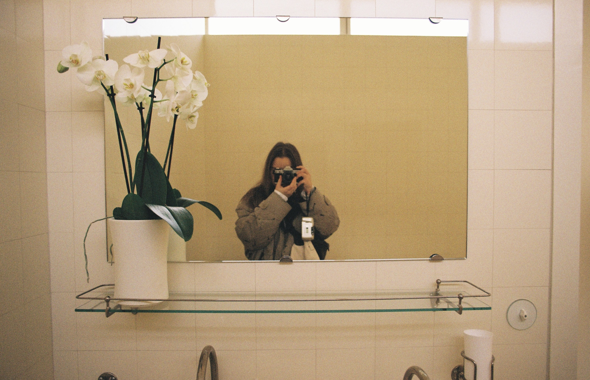
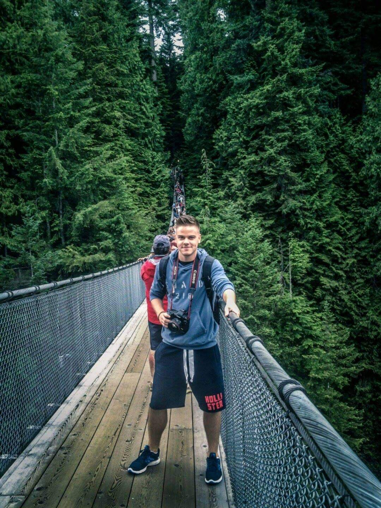

[Home](index.md)
[Work](work/index.md)
[Writing](writing/index.md)

## My journey

The way of expressing my thoughts, feelings, or opinions verbally has always been foreign to me. Searching for the right words and putting them into sentences often seemed impossible. I found the possibility of expressing myself through art at the age of six in an art school. However, later on, I realized that painting represents a limitless risk for me, so I turned to science for a while; including math, biology, physics, but also psychology. I found meaning in numbers, facts, and results. After many years of searching for my path, I came to the golden middle way, which is graphic design.

Today, I strive to create designs that resonate with others on a profound level, allowing each person to find their own depths and experience their unique emotions. 

In the future, I would like to use my work as a medium to comfort individuals, reminding them that they are not alone in their struggles. 

## What I live for

When I am not working on my graphics, I am most likely in my painting studio or somewhere aroud the globe, searching for funcionalist architecture with my dearest analog.

## Photography became a family thing

Photography has a sentimental value for me, as my brother was a professional photographer. After he died, I struggled a lot and now I feel like we connect again with every picture that I take. 

### Get in touch

nataliabuzkova@gmail.com

Instagram: @natalia_buzkova / @sournsweetz
